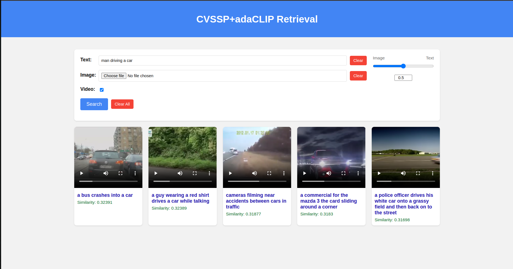

# CVSSP_Retrieval with AdaCLIP support

This is a retrieval method used for MSRVTT dataset and laion embeddings. The video retrieval is invoked using the button triggers the AdaCLIP model.

AdaCLIP was built for the purpose of text to video retrieval. Although it can perform video to text as well, we primarily use it for text to video.

The text to image and image to text retrieval is performed using the CLIP model using the laion embeddings.
This simple web application was built as a small part of the CVSSP dissertation for the University of Surrey in 2024.

**AdaCLIP Video retrieval**

**CLIP retrieval**

Thank you AdaCLIP for your work!
@inproceedings{AdaCLIP,
    title={AdaCLIP: Towards Pragmatic Multimodal Video Retrieval},
    author={Hu, Zhiming and Ye, Angela N and Khorasgani, Salar H and Mohomed, Iqbal},
    booktitle={Proc. of the 31st ACM International Conference on Multimedia},
    year={2023}
}